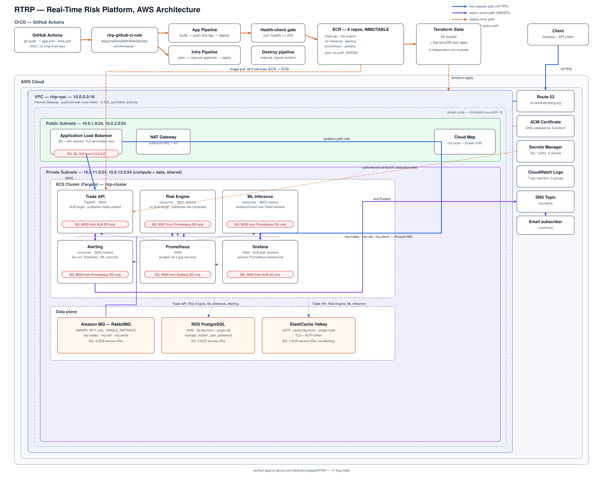

# Real-Time Risk Platform (RTRP)

A cloud-native trade risk platform, built milestone by milestone as a hands-on
AWS/Terraform/CI-CD learning project. M1 ships a containerised Trade API
behind HTTPS on ECS Fargate. M2 turns it event-driven with a RabbitMQ broker
(Amazon MQ) and a Risk Engine consumer. M3 adds persistence (Postgres),
caching (Redis/Valkey), and observability (Prometheus + Grafana). M4 adds a
second event-driven pipeline downstream of Risk Engine: ML Inference flags
statistically anomalous exposure, and Alerting turns either a threshold
breach or a flagged anomaly into a real SNS email notification. M5 (not
started) is a planned migration of the compute layer from ECS Fargate to
EKS.

## Project Overview

RTRP accepts trade executions over an HTTP API and publishes them as events
to a message broker. Downstream services never call each other directly —
only through the broker — which is what lets six independently deployable
services scale, restart, and fail without taking each other down.

- **Trade API** (`main.py`) — FastAPI service. `GET /health` for liveness;
  `POST /trades` validates a trade, persists it to Postgres, caches the
  latest risk figure in Redis, and publishes a `trade.created` event to
  RabbitMQ, returning `202 Accepted` once the event is durably queued.
  `GET /risk/{symbol}` serves the latest computed exposure, cache-first.
- **Risk Engine** (`risk_engine/main.py`) — a standalone consumer with no
  inbound network access at all. It computes a risk figure per trade
  (notional exposure — a placeholder for real VaR/PnL logic), persists and
  caches the result, and publishes a `risk.computed` event to a second
  exchange for M4's consumers.
- **ML Inference** (`ml_inference/main.py`) — consumes `risk.computed`,
  keeps a rolling per-symbol window in Redis, and runs `IsolationForest`
  against each new value to flag statistically unusual exposure, publishing
  `alert.triggered` when it does.
- **Alerting** (`alerting/main.py`) — a single queue bound to both the
  threshold rule (`risk.computed` over `$50k`) and ML Inference's flagged
  anomalies, fanning both into one SNS topic, one Postgres audit table, and
  one Prometheus counter.
- **RabbitMQ** — Amazon MQ, single-instance broker, private-subnet only,
  AMQPS (TLS) only. Three topic exchanges: `rtrp.trades`, `rtrp.risk`,
  `rtrp.alerts`. [ADR-002](docs/adr/ADR-002-managed-rabbitmq-via-amazon-mq.md)
  covers why it's managed rather than self-hosted.
- **Postgres** (RDS) and **Redis/Valkey** (ElastiCache) — durable storage and
  a cache-first read path shared by all four app services that need them.
- **Prometheus + Grafana** — every service exposes `/metrics`; Grafana
  dashboards make trade rate, processing latency, risk exposure, and now
  anomalies/alerts visible without going through the CLI.
- **Cloud Map** — private DNS (`*.rtrp.local`) so services find each other
  by name instead of hardcoded IPs.

Why this milestone structure exists at all — deploying a single container
correctly, with real infra-as-code and CI/CD, before adding messaging — is
covered in [ADR-001](docs/adr/ADR-001-ecs-before-eks.md).

## Architecture



Three path types run through this system, colour-coded in the diagram: the
**live request path** (blue) is a synchronous HTTPS call — Client → Route 53
→ ALB → Trade API is the only one that exists today (Grafana is reachable
the same way, over `/grafana`, but that's an operator path, not the
product). The **async event path** (purple) is everything downstream of a
trade landing — Trade API publishes, Risk Engine consumes and republishes,
ML Inference and Alerting consume in turn, and none of those four services
ever call each other's ports directly, only the broker. The **deploy-time
path** (orange) is CI/CD: GitHub Actions assumes `rtrp-github-ci-role` via
OIDC (no long-lived AWS keys anywhere), builds and pushes images to ECR, and
applies Terraform behind a manual approval gate.

A few things worth pointing out that aren't obvious from the boxes alone:

- Every ECS service's security group is scoped to exactly one peer — the
  pill under each box states it explicitly (e.g. Risk Engine only accepts
  :8001 from Prometheus's security group, nothing else, from nowhere else).
  Nothing is reachable "from the VPC" as a blanket rule; each hop is a named
  security group reference, not a CIDR block.
- Only Trade API and Grafana have an ALB target. Risk Engine, ML Inference,
  and Alerting are pure background consumers with zero inbound access —
  by design, not by omission (see `infra/modules/ecs/04-risk-engine.tf` and
  its M4 siblings).
- Secrets never appear in Terraform state as plaintext beyond Secrets
  Manager itself, and are injected into containers at launch via the ECS
  execution role — not baked into images or task definitions.
- The broker, database, and cache each expose one security group shared by
  every service that needs them, rather than a separate security group per
  consumer pair. Widening that list — adding ML Inference and Alerting to
  three existing security groups, not just one — is exactly what M4 needed
  when those two services came online.
- Each `infra/*` directory (9 of them now) is an independent Terraform root
  module with its own S3 state key, stitched together via
  `terraform_remote_state` reads rather than one big root module. That
  buys independent deployability at the cost of apply-order fragility
  between modules that read each other's outputs — documented as a known
  tradeoff, not a hidden one.

## App Demo

<!-- TODO: screenshot showing https://tm.sentineltrading.org in a browser
     address bar with the padlock/HTTPS indicator visible, and the /health
     response. Capture this manually — it has to be a real browser screenshot. -->

`https://tm.sentineltrading.org/health` → `{"status": "ok"}`

## Local Setup

Requires Python 3.12+.

```bash
python -m venv .venv
source .venv/bin/activate
pip install -r requirements.txt
python main.py
```

`GET /health` works immediately with no configuration. `POST /trades` will
not — it requires `RABBITMQ_URL`, `RABBITMQ_USERNAME`, `RABBITMQ_PASSWORD` to
be set, **and** the RabbitMQ broker is only reachable from inside the VPC
(`publicly_accessible = false` in `infra/messaging/main.tf`), so it cannot be
exercised end-to-end from a local machine at all — only from inside a
deployed ECS task, or against a broker of your own (e.g. a local RabbitMQ
container). `test_main.py` mocks the publish step specifically so tests don't
depend on any of this.

Run tests:
```bash
pip install -r requirements.txt
pytest -v
```

Run via Docker:
```bash
docker build -t rtrp-trade-api .
docker run -p 8000:8000 rtrp-trade-api
```

The Risk Engine (`risk_engine/`) has its own `requirements.txt` and
`Dockerfile` — it's a separate service with a separate dependency set (no
FastAPI/uvicorn, since it never listens on a port).

## Project Structure

```
.
├── main.py                    # Trade API (FastAPI)
├── test_main.py                # Trade API tests
├── requirements.txt
├── Dockerfile                  # Trade API image
├── risk_engine/
│   ├── main.py                  # Risk Engine consumer/publisher
│   ├── requirements.txt
│   └── Dockerfile
├── ml_inference/
│   ├── main.py                  # Anomaly detection consumer (IsolationForest)
│   ├── requirements.txt
│   └── Dockerfile
├── alerting/
│   ├── main.py                  # Threshold + ML-anomaly fan-out, SNS publish
│   ├── requirements.txt
│   └── Dockerfile
├── prometheus/
│   └── prometheus.yml           # Scrape config, all 4 app service targets
├── grafana/
│   ├── dashboards/               # Dashboard JSON, provisioned on boot
│   └── provisioning/             # Datasource + dashboard provider config
├── docs/
│   ├── architecture.svg          # This README's diagram
│   └── adr/                      # Architecture Decision Records
│       ├── ADR-001-ecs-before-eks.md
│       └── ADR-002-managed-rabbitmq-via-amazon-mq.md
├── infra/                      # Terraform, one deployable root module per directory
│   ├── bootstrap/                # S3 state bucket + DynamoDB lock table (local state only)
│   ├── vpc/                      # VPC, public/private subnets, NAT gateway
│   ├── ecr/                      # 6 container image repositories
│   ├── ecs/                      # ECS cluster, ALB, all 6 services
│   ├── dns/                      # Route 53 zone, ACM certificate
│   ├── messaging/                # Amazon MQ (RabbitMQ) broker
│   ├── database/                 # RDS Postgres
│   ├── cache/                    # ElastiCache Valkey
│   ├── alerting/                 # SNS topic + email subscription
│   ├── cicd/                     # GitHub OIDC provider + CI IAM role
│   └── modules/                  # Child modules — ecr, ecs, messaging, database, cache, alerting, cicd
└── .github/workflows/
    ├── app.yml                   # Build + push image, deploy to ECS — 6 jobs
    ├── infra.yml                 # terraform plan (PRs) / apply (main, gated) — 9 modules
    └── infra-destroy.yml         # terraform destroy, manual trigger only
```

Each `infra/*` directory is an independent Terraform root module with its own
S3 backend key — not child modules invoked from one root. They're stitched
together via `terraform_remote_state` reads (e.g. `ecs` reads `vpc`'s VPC ID
and subnet IDs, and now `alerting`'s SNS topic ARN). This means each layer is
separately deployable and independently stateful, at the cost of apply-order
constraints between modules that reference each other — `ecs` failing because
`alerting`'s state didn't exist yet was a real instance of this, not just a
theoretical risk.

## Pipelines

<!-- TODO: screenshots of app.yml, infra.yml (plan + apply), and
     infra-destroy.yml all showing successful runs in the GitHub Actions tab. -->

- **`app.yml`** — on push to `main` touching app code: 6 independent jobs
  (Trade API, Risk Engine, ML Inference, Alerting, Prometheus, Grafana), each
  building and pushing a sha-tagged image and deploying via
  `amazon-ecs-render-task-definition` + `amazon-ecs-deploy-task-definition`.
  Only Trade API gates on a live `/health` check — the others are background
  consumers with nothing to curl.
- **`infra.yml`** — plans on every PR touching `infra/**`; applies on push to
  `main`, behind a manual approval environment (`production-infra`), across
  9 independent Terraform root modules.
- **`infra-destroy.yml`** — manual-only (`workflow_dispatch`, requires typing
  a confirmation phrase), tears down infrastructure in dependency order. Not
  something to run casually — see the comments in the workflow file for why
  the destroy order matters and where its known limitation is.
