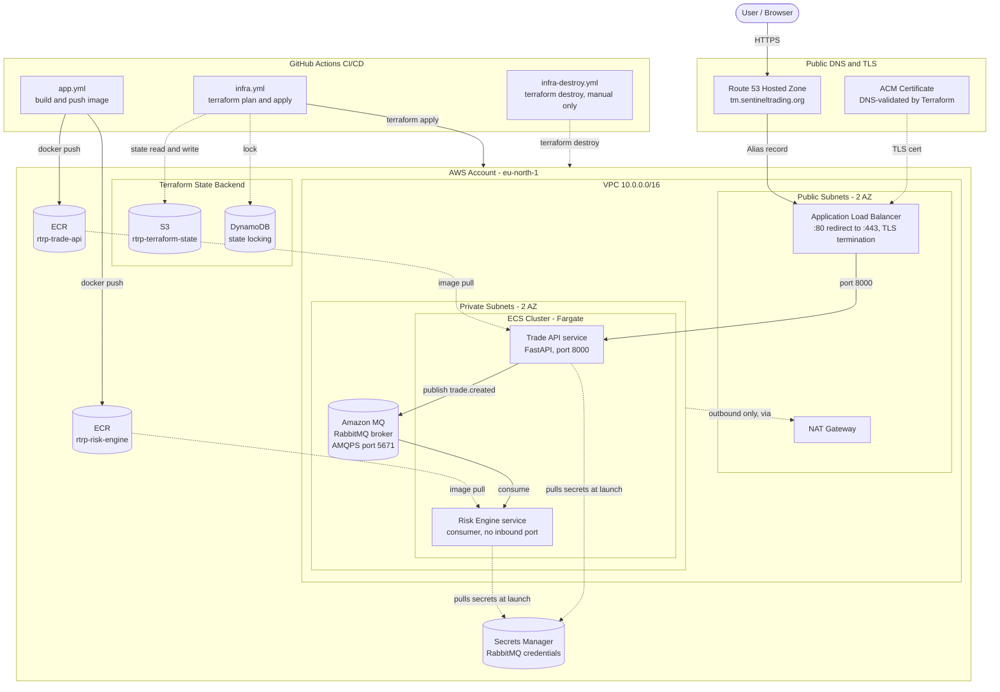

# Real-Time Risk Platform (RTRP)

A cloud-native trade risk platform, built milestone by milestone as a hands-on
AWS/Terraform/CI-CD learning project. Milestone 1 ships a containerised Trade
API behind HTTPS on ECS Fargate; Milestone 2 turns it event-driven with a
RabbitMQ broker (Amazon MQ) and a Risk Engine consumer.

## Project Overview

RTRP accepts trade executions over an HTTP API, publishes them as events to a
message broker, and a separate Risk Engine service consumes those events to
compute risk metrics. The two services never call each other directly —
only through the broker. That's what lets them be deployed, scaled, and
restarted independently of each other.

- **Trade API** (`main.py`) — FastAPI service. `GET /health` for liveness;
  `POST /trades` validates a trade and publishes a `trade.created` event to
  RabbitMQ, returning `202 Accepted` once the event is durably queued.
- **Risk Engine** (`risk_engine/main.py`) — a standalone consumer with no
  inbound network access at all. It binds a durable queue to the broker,
  computes a risk figure per trade (notional exposure, for now — a
  placeholder for real VaR/PnL logic), and logs the result.
- **RabbitMQ** — Amazon MQ, single-instance broker, private-subnet only,
  AMQPS (TLS) only. [ADR-002](docs/adr/ADR-002-managed-rabbitmq-via-amazon-mq.md)
  covers why it's managed rather than self-hosted, including the cost
  tradeoff that decision turned out to involve.

Why this milestone structure exists at all — deploying a single container
correctly, with real infra-as-code and CI/CD, before adding messaging — is
covered in [ADR-001](docs/adr/ADR-001-ecs-before-eks.md).

## Architecture



A few things worth pointing out in the diagram: the ECS tasks and the RabbitMQ broker
live only in private subnets with no public IPs — the ALB is the only public
entry point, and it only forwards to the Trade API (the Risk Engine has no
load balancer target at all, by design — see `infra/ecs/04-risk-engine.tf`).
Secrets never appear in Terraform state as plaintext beyond Secrets Manager
itself, and are injected into containers at launch via the ECS execution
role, not baked into images or task definitions.

## App Demo

<!-- TODO: screenshot showing https://tm.sentineltrading.org in a browser
     address bar with the padlock/HTTPS indicator visible, and the /health
     response. Capture this manually — it has to be a real browser screenshot. -->

`https://tm.sentineltrading.org/health` → `{"status": "ok"}`

## Local Setup

Requires Python 3.12+.

```bash
python -m venv .venv
source .venv/bin/activate
pip install -r requirements.txt
python main.py
```

`GET /health` works immediately with no configuration. `POST /trades` will
not — it requires `RABBITMQ_URL`, `RABBITMQ_USERNAME`, `RABBITMQ_PASSWORD` to
be set, **and** the RabbitMQ broker is only reachable from inside the VPC
(`publicly_accessible = false` in `infra/messaging/main.tf`), so it cannot be
exercised end-to-end from a local machine at all — only from inside a
deployed ECS task, or against a broker of your own (e.g. a local RabbitMQ
container). `test_main.py` mocks the publish step specifically so tests don't
depend on any of this.

Run tests:
```bash
pip install -r requirements.txt
pytest -v
```

Run via Docker:
```bash
docker build -t rtrp-trade-api .
docker run -p 8000:8000 rtrp-trade-api
```

The Risk Engine (`risk_engine/`) has its own `requirements.txt` and
`Dockerfile` — it's a separate service with a separate dependency set (no
FastAPI/uvicorn, since it never listens on a port).

## Project Structure

```
.
├── main.py                    # Trade API (FastAPI)
├── test_main.py                # Trade API tests
├── requirements.txt
├── Dockerfile                  # Trade API image
├── risk_engine/
│   ├── main.py                 # Risk Engine consumer
│   ├── requirements.txt
│   └── Dockerfile
├── docs/adr/                   # Architecture Decision Records
│   ├── ADR-001-ecs-before-eks.md
│   └── ADR-002-managed-rabbitmq-via-amazon-mq.md
├── infra/                      # Terraform, one deployable unit per directory
│   ├── bootstrap/               # S3 state bucket + DynamoDB lock table (local state only)
│   ├── vpc/                     # VPC, public/private subnets, NAT gateway
│   ├── ecr/                     # Container image repositories
│   ├── ecs/                     # ECS cluster, ALB, Trade API + Risk Engine services
│   ├── dns/                     # Route 53 zone, ACM certificate
│   ├── messaging/               # Amazon MQ (RabbitMQ) broker
│   └── cicd/                    # GitHub OIDC provider + CI IAM role
└── .github/workflows/
    ├── app.yml                  # Build + push image, deploy to ECS
    ├── infra.yml                # terraform plan (PRs) / apply (main, gated)
    └── infra-destroy.yml        # terraform destroy, manual trigger only
```

Each `infra/*` directory is an independent Terraform root module with its own
S3 backend key — not child modules invoked from one root. They're stitched
together via `terraform_remote_state` reads (e.g. `ecs` reads `vpc`'s VPC ID
and subnet IDs). This means each layer is separately deployable and
independently stateful, at the cost of apply-order constraints between
modules that reference each other.

## Pipelines

<!-- TODO: screenshots of app.yml, infra.yml (plan + apply), and
     infra-destroy.yml all showing successful runs in the GitHub Actions tab. -->

- **`app.yml`** — on push to `main` touching app code: builds and pushes the
  Docker image to ECR, forces a new ECS deployment, then gates on a live
  `/health` check.
- **`infra.yml`** — plans on every PR touching `infra/**`; applies on push to
  `main`, behind a manual approval environment (`production-infra`).
- **`infra-destroy.yml`** — manual-only (`workflow_dispatch`, requires typing
  a confirmation phrase), tears down infrastructure in dependency order. Not
  something to run casually — see the comments in the workflow file for why
  the destroy order matters and where its known limitation is.
